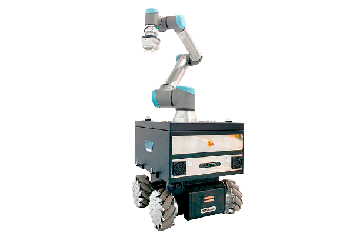

# rbkairos_sim

Packages for the simulation of the RB-Kairos.

<p align="center">
  
</p>

## Packages

### rbkairos_gazebo

This package contains the configuration files and worlds to launch the Gazebo environment along with the simulated robot.

### rbkairos_sim_bringup

Launch files that launch the complete simulation of the robot/s.


## Installation

### 1) Install the following dependencies:

This simulation has been tested using Gazebo 9.19 version. To facilitate the installation you can use the vcstool:

```bash
sudo apt-get install -y python3-vcstool
```

### 2) Create a workspace and clone the repository:

```bash
mkdir catkin_ws

cd catkin_ws

vcs import --input \
 https://raw.githubusercontent.com/RobotnikAutomation/rbkairos_sim/melodic-devel/repos/rbkairos_sim.repos

rosdep install --from-paths src --ignore-src -y
```

### 3) Compile:

```bash
catkin build
source devel/setup.bash
```

## Bringup


```
roslaunch rbkairos_sim_bringup rbkairos_complete.launch
```

This launch files runs Gazebo and the ROS controllers to work with the RB-KAIROS robot. This launch accepts multiple parameters to work with.

By default it runs a full world with all the standard packages for navigation, localization and manipulation.

If you want to launch Moveit you have to run:


```
roslaunch rbkairos_sim_bringup rbkairos_complete.launch moveit_movegroup_a:=true
```


The default configuration will load a RB-Kairos + UR5 + EGH gripper. Other configurations are also available.
